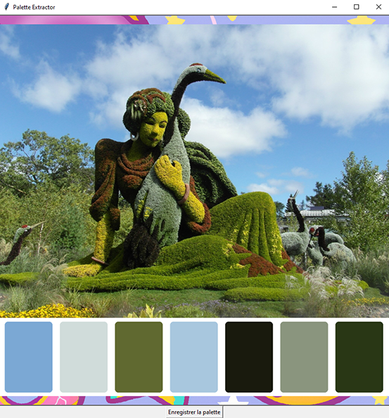

# Color-Palette

Welcome to Color Palette, a Python application with a graphical interface allowing to extract a color palette from any image, and to create a new image with this palette.

## Features

- **Image Drag and Drop:** You can easily import any image by dragging and dropping it into the application interface.
- **Color Palette Extraction:** Once the image is imported, the application automatically extracts a color palette from this image, by analyzing the pixels and determining the dominant colors.

- **Creation of a New Image:** You can then use the extracted color palette to create a new image, by applying these colors to an image tile. This can be useful in fields like cinema or photography to get the "look" of an image.

- **Saving the Created Image:** Once the new image is generated, you have the option to save it to your system for later use.

## Instructions

To use Color Palette, follow these simple steps:

1. **Prerequisites Installation:** Make sure you have Python installed on your system. You can install the necessary dependencies by running the following command:

2. **Launching the Application:** Run the `main.py` file to start the application. You can do this by using the following command in the terminal:

python ColorThief7.py

3. **Image Drag and Drop:** Drag and drop any image of any format into the application interface to start the color palette extraction process.

4. **Color Palette Visualization:** Once the image is imported, you will see the extracted color palette displayed in the application interface.

5. **Creation and Saving of the New Image:** Use the extracted colors to create a new image, then save it to your system for later use.

Enjoy Color Palette to create unique color palettes from your favorite images! If you have suggestions for improvement or bug reports, do not hesitate to report them. Thank you for your support and your interest in this application.

